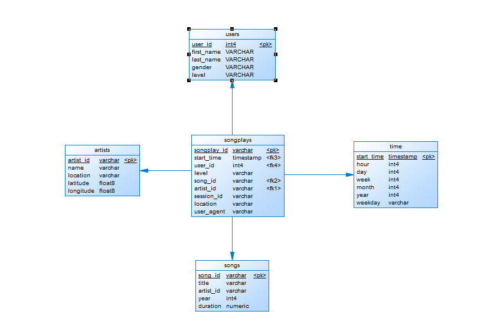

# Data Modeling with Postgres

## Introduction

This project refers to a startup called Sparkify. She wants to do an analysis of the music that users listen to.

Files are provided in JSON format. These files will be read and stored in a star schema.

## Prerequisites

This project makes the folowing assumptions:

* Python 3 is available
* `pandas` and `psycopg2` are available
* A PosgreSQL database is available on localhost

## Running the Python Scripts

At the terminal:

1. ```python create_tables.py```
2. ```python etl.py```

In IPython:

1. ```run create_tables.py```
2. ```run etl.py```

## Database Schema



## create_tables.py

This Python script recreates the database and tables used to storethe data.

## etl.ipynb

A Python Jupyter Notebook that was used to initially explore the data and test the ETL process.

## etl.py

This Python script reads in the Log and Song data files, processes and inserts data into the database.

## requirements

A list of Python modules used by this project.

## sql_queries.py

A Python script that defines all the SQL statements used by this project.

## test.ipynb

A Python Jupyter Notebook that was used to test that data was loaded properly.